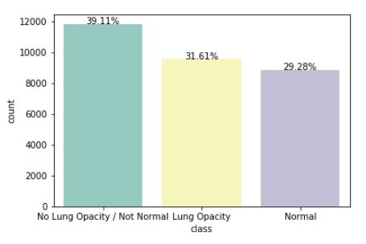
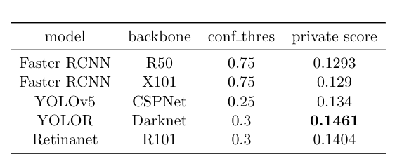
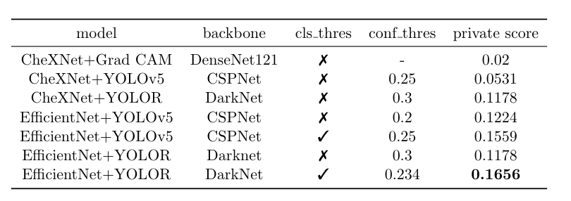

# rsna-pneumonia-detection


### [Report](https://drive.google.com/file/d/1S0MRRq2Ej19p18ZYs3y1Lb5WDHZN7xLV/view?usp=sharing) | [Slides](https://drive.google.com/file/d/1iMC_G35EuJ9ObWxtH5yVydpKOANabI_2/view?usp=sharing)

## Teammate
* Zhi-Yi Chin: joycenerd.cs09@nycu.edu.tw
* Chieh-Ming Jiang: nax1016.cs10@nycu.edu.tw

## Introduction
This repository is implementation of final project for IOC5008 Selected Topics in Visual Recognition using Deep Learning course in 2021 fall semester at National Yang Ming Chiao Tung University.

In the final project, we participated the RSNA Pneumonia Detection Challenge on Kaggle. The challenge is about to detect a visual signal for pneumonia in medical images. The dataset contains about 30,000 medical images, which belong to 3 kind of different classes. The classes are Lung Opacity, No Lung Opacity / Not Normal and Normal respectively. Lung Opacity means the patient is diagnosed with pneumonia. No Lung Opacity / Not Normal means the patient is diagnosed as other lung diseases but not pneumonia. The Normal class means no disease is detected. As a consequence, it is not easy to detect pneumonia with these data. First of all, the No Lung Opacity / Not Normal class may mislead the model. Secondly, the data is extremely imbalanced as the figure shown below. Images with bounding box.



We have tried detection only method, first classification then detection method and ensembling. We get the best results when using EficientNet as classification model with 0.2 classfication probability threshold when testing, and YOLOR as detection model. We think our method's main contribution is to do classification first then detection to reduce false positive results, due to the nature of our highly imbalanced data.

Below are the instructions to reproduce our best results.

## Getting the code

You can download a copy of all the files in this repository by cloning this repository:

```
git clone https://github.com/joycenerd/rsna-pneumonia-detection.git
```

## Requirements

You need to have [Anaconda](https://www.anaconda.com/) or Miniconda already installed in your environment. To install requirements:

### Create a conda environment
```
conda create -n  rsna
conda activate rsna
```

### 2. Install dependencies

* For data pre-processing
    ```
    conda install -c conda-forge gdcm -y
    conda install numpy
    conda install pillow
    pip install pydicom
    conda install tqdm
    ```
* For YOLOR
    ```
    conda env update --file yolor.yml --prune
    ```
* For EfficientNet
    ```
    pip install efficientnet_pytorch
    ```

## Dataset

You can choose to download the data that we have pre-processed already or you can download the raw data.

### Option#1: Download the data that have been pre-processed

**EfficientNet used data**
1. Download the data from the Google drive link: (**TBD**)
2. After decompress the zip file, the data folder structure should look like this:
```
rsna_data_all
├── annotations
│   ├── train
│   │   ├── 0004cfab-14fd-4e49-80ba-63a80b6bddd6.txt
│   │   ├── 000924cf-0f8d-42bd-9158-1af53881a557.txt
│   │   ├── ...
│   └── val
│       ├── 001031d9-f904-4a23-b3e5-2c088acd19c6.txt
│       ├── 0022995a-45eb-4cfa-9a59-cd15f5196c64.txt
│       ├── ...
├── dir.txt
├── images
│   ├── test
│   │   ├── 0000a175-0e68-4ca4-b1af-167204a7e0bc.png
│   │   ├── 0005d3cc-3c3f-40b9-93c3-46231c3eb813.png
│   │   └── ...
│   ├── train
│   │   ├── 0004cfab-14fd-4e49-80ba-63a80b6bddd6.png
│   │   ├── 000924cf-0f8d-42bd-9158-1af53881a557.png
│   │   └── ...
│   └── val
│       ├── 001031d9-f904-4a23-b3e5-2c088acd19c6.png
│       ├── 0022995a-45eb-4cfa-9a59-cd15f5196c64.png
│       └── ...
├── test.txt
├── train.txt
└── val.txt
```

### Option#2: Download the raw data
1. Download the data from Kaggle RSNA Pneumonia detection challenge: [rsna-pneumonia-detection-challenge.zip](https://www.kaggle.com/c/rsna-pneumonia-detection-challenge/data)
2. Decompress the data: `unzip rsna-pneumonia-detection-challenge.zip -d rsna_data`

The data folder structure should look like this:
```
rsna_data
├── GCP Credits Request Link - RSNA.txt
├── stage_2_detailed_class_info.csv
├── stage_2_sample_submission.csv
├── stage_2_test_images
│   ├── 0000a175-0e68-4ca4-b1af-167204a7e0bc.dcm
│   ├── 0005d3cc-3c3f-40b9-93c3-46231c3eb813.dcm
│   ├── ...
├── stage_2_train_images
│   ├── 0004cfab-14fd-4e49-80ba-63a80b6bddd6.dcm
│   ├── 000924cf-0f8d-42bd-9158-1af53881a557.dcm
│   ├── ...
└── stage_2_train_labels.csv
```

### Data pre-processing

**Note: If you download the data by following option#1 you can skip this step.**

#### For EfficientNet
1. convert dicom image to png image and create YOLO annotations
  ```
  python yolo_annot_all.py --dataroot <data_dir>/rsna_data
  ```
  * input: data roor dir
  * output:
    * images/all_train: all training images after histogram equalization
    * annotations/all_train: YOLO annotation text files
2. Train valid split
  ```
  python train_valid_split_all.py --data-root <data_dir>/rsna_data_all --ratio 0.2
  ```
  * input: data root dir
  * output: (all the outputs are generated in data root dir)
    * images/train, annotations/train: training images and annotations
    * images/val, annotations/val: validation images and annotations
3. Record the complete path of all the training and validation images
  ```
  cd efficientnet
  python record_path.py --dataroot <data_dir>/rsna_data_all
  ```
  * input: data root dir
  * output: train.txt, val.txt generated in data root dir
4. Record test images name
  ```
  cd efficientnet
  python gen_test_path.py --dataroot <data_dir>rsna_data_all
  ```
  * input: data root dir
  * output: test.txt in data root dir

#### For YOLOR
1. Convert dcm to png
  ```
  python dcm2png.py --dataroot <data_dir>/rsna_data/ --mode train
  python dcm2png.py --dataroot <data_dir>/rsna_data/ --mode test
  ```
2. Create yolo annotation
  ```
  python yolo_annot.py --dataroot <data_dir>/rsna_data/ --destroot <data_dir>/rsna_data/
  ```
3. Split train & valid data
  ```
  python train_valid_split.py --data-root <data_dir>/rsna_data/ --ratio 0.1
  ```

## EfficientNet

You should have Graphics card to train the model. For your reference, we trained on 3 NVIDIA RTX 1080Ti.

### Training
```
cd efficientnet
python train.py --data-root <data_dir>rsna_data_all --gpu 0 1 2 --logs <out_dir>/rsna_outputs/efficientnet_b4 --lr 0.005 --model efficientnet-b4 --img-size 380 --train-batch-size 21 --dev-batch-size 8 --num-classes 2
```
* input: data root dir
* output: The logging directory will be generated in the path you specified for `--logs`. Inside this logging directory you can find:
  * `checkpoints/`: All the training checkpoints will be saved inside here. Checkpoints is saved every 10 epochs and `best_model.pth` save the current best model based on evaluation accuracy.
  * `events/`: Tensorboard event files, you can visualize your experiment by `tensorboard --logdir events/`
  * `logger/`: Some information that print on screen while training will be log into here for your future reference.

### Validation
```
cd efficientnet
python val.py --data-root <data_dir>/rsna_data_all --gpu 0 1 --logs ./ --num-classes 2 --ckpt <checkpoint_path>
```
* input: 
  * data root dir
  * trained model weights
* The validation score will print on the screen after execution.

### Testing
```
cd efficientnet
python test.py --data-root <data_dir>/rsna_data_all --ckpt <checkpoint_path> --img-size 380 --net efficientnet-b4 --gpu 0 --savedir <data_dir>/rsna_data_all/images/test_detect --num-classes 2 --thres 0.2
```
* input: 
  * data root dir
  * trained model weights
* output:
  * images/test_detect: images that are classified as pneumonia (this will be saved in data root dir)
  * answer.txt: record the image name of images that are classified as pneumonia (YOLOR input)

## YOLOR

### Training
You need to change the filepath in yolor/config.yaml
```
cd yolor
python train.py --batch-size 4 --img 1280 1280 --data config.yaml --cfg cfg/yolor_w6.cfg --weights '' --device 3 --name yolor_w6 --hyp hyp.scratch.1280.yaml --epochs 300
```
### Testing
```
cd yolor
python detect.py --source <path_to_testing_images> --cfg cfg/yolor_w6.cfg --weights best.pt --conf 0.234 --img-size 1024 --device 0 --save-txt --output rsna_output/yolor_w6 --classification-path answer.txt
```
### Post-processing
1. Create prediction json file
  ```
  cd yolor
  python yolo2json.py --txt-path <save_dir>rsna_output/yolor_w6/ --test-img  <data_dir>/rsna_data/images/test/
  ```
2. Create csv submission
  ```
  cd yolor
  python yolo_create_submission.py --pred-json answer.json --test-img <data_dir>/rsna_data/images/test
  ```

## Submit the results
Upload the submission.txt to Kaggle RSNA Pneumonia detection challenge: [Late Submission](https://www.kaggle.com/c/rsna-pneumonia-detection-challenge/submit)

## Results and Models

### Pre-trained weights
* This is the Google drive link of trained EfficientNet-b4 model weights: [epoch_30.pth](https://drive.google.com/file/d/1CGD-evmXfgjTod_StM422qy-_-CqiRUy/view?usp=sharing)
* This is the Google drive link of trained YOLOR model weights: [best.pt](https://drive.google.com/file/d/1pNnBwk_KVDgIavoRxRkF5hbMxWw7xOw3/view?usp=sharing)

### Detection only results


### First classification then detection results


### Final results
Shrink the width and height of the predicted bounding box by 87.5% yields the best results: 18.9%.


## Reproduce our submission
To reproduce our best results, do the following steps:
1. [Getting the code](#getting-the-code)
2. [Install the dependencies](#requirements)
3. [Download raw data](#dataset) (Following **Option #2**)
4. [Data-preprocessing for EfficientNet](#for-efficientnet) (Only need to do **4. Record test images name**)
5. [Data-preprocessing for YOLOR](#for-yolor)
4. [Download pre-trained weights](#pre-trained-weights)
5. [Testing](#testing)
6. [Post processing](post-processing)
7. [Submit the results](#submit-the-results)

## FAQ
If any problem occurs when you are using this project, you can first check out [faq.md](docs/faq.md) to see if there are solutions to your problem.

## GitHub Acknowledgement
We thank the authors of these repositories:
* [ultralytics/yolov5](https://github.com/ultralytics/yolov5)
* [open-mmlab/mmdetection](https://github.com/open-mmlab/mmdetection)
* [thtang/CheXNet-with-localization](https://github.com/thtang/CheXNet-with-localization)
* [WongKinYiu/yolor](https://github.com/WongKinYiu/yolor)

## Citation
If you find our work useful in your project, please cite:

```bibtex
@misc{
    title = {rsna-pneumonia-detection},
    author = {Zhi-Yi Chin, Chieh-Ming Jiang},
    url = {https://github.com/joycenerd/rsna-pneumonia-detection},
    year = {2021}
}
```

## Contributing

If you'd like to contribute, or have any suggestions, you can contact us at [joycenerd.cs09@nycu.edu.tw](mailto:joycenerd.cs09@nycu.edu.tw) or open an issue on this GitHub repository.

All contributions welcome! All content in this repository is licensed under the MIT license.
